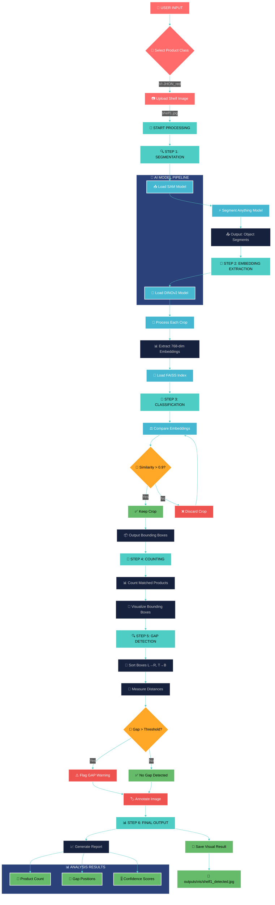

```mermaid
%%{init: {
    'theme': 'dark',
    'themeVariables': {
        'primaryColor': '#ff6b6b',
        'primaryTextColor': '#ffffff',
        'primaryBorderColor': '#ff6b6b',
        'lineColor': '#4ecdc4',
        'secondaryColor': '#4ecdc4',
        'tertiaryColor': '#45b7d1',
        'background': '#1a1a2e',
        'mainBkg': '#16213e',
        'secondBkg': '#0f3460',
        'tertiaryBkg': '#533483'
    }
}}%%

flowchart TD
    %% User Input Section
    A[👤 USER INPUT] --> B{🎯 Select Product Class}
    B --> |"VI-JHON_red"| C[📷 Upload Shelf Image]
    C --> |"shelf1.jpg"| D[🚀 START PROCESSING]
    
    %% Step 1: Segmentation
    D --> E[🔍 STEP 1: SEGMENTATION]
    E --> E1[📥 Load SAM Model]
    E1 --> E2[⚡ Segment Anything Model]
    E2 --> E3[📤 Output: Object Segments]
    
    %% Step 2: Embedding
    E3 --> F[🧠 STEP 2: EMBEDDING EXTRACTION]
    F --> F1[🤖 Load DINOv2 Model]
    F1 --> F2[🔄 Process Each Crop]
    F2 --> F3[📊 Extract 768-dim Embeddings]
    F3 --> F4[💾 Load FAISS Index]
    
    %% Step 3: Classification
    F4 --> G[🎯 STEP 3: CLASSIFICATION]
    G --> G1[⚖️ Compare Embeddings]
    G1 --> G2{📏 Similarity > 0.9?}
    G2 --> |Yes| G3[✅ Keep Crop]
    G2 --> |No| G4[❌ Discard Crop]
    G3 --> G5[📦 Output Bounding Boxes]
    G4 --> G1
    
    %% Step 4: Counting
    G5 --> H[🔢 STEP 4: COUNTING]
    H --> H1[📊 Count Matched Products]
    H1 --> H2[🎨 Visualize Bounding Boxes]
    
    %% Step 5: Gap Detection
    H2 --> I[🔍 STEP 5: GAP DETECTION]
    I --> I1[📐 Sort Boxes L→R, T→B]
    I1 --> I2[📏 Measure Distances]
    I2 --> I3{🚨 Gap > Threshold?}
    I3 --> |Yes| I4[⚠️ Flag GAP Warning]
    I3 --> |No| I5[✅ No Gap Detected]
    I4 --> I6[🏷️ Annotate Image]
    I5 --> I6
    
    %% Step 6: Final Output
    I6 --> J[📊 STEP 6: FINAL OUTPUT]
    J --> J1[💾 Save Visual Result]
    J1 --> J2[📁 outputs/vis/shelf1_detected.jpg]
    J --> J3[📈 Generate Report]
    J3 --> J4[🎯 Product Count]
    J3 --> J5[📍 Gap Positions]
    J3 --> J6[🎚️ Confidence Scores]
    
    %% Styling
    classDef userInput fill:#ff6b6b,stroke:#ffffff,stroke-width:3px,color:#ffffff
    classDef processing fill:#4ecdc4,stroke:#ffffff,stroke-width:2px,color:#000000
    classDef aiModel fill:#45b7d1,stroke:#ffffff,stroke-width:2px,color:#ffffff
    classDef decision fill:#ffa726,stroke:#ffffff,stroke-width:2px,color:#000000
    classDef output fill:#66bb6a,stroke:#ffffff,stroke-width:2px,color:#000000
    classDef warning fill:#ef5350,stroke:#ffffff,stroke-width:2px,color:#ffffff
    
    class A,B,C userInput
    class D,E,F,G,H,I,J processing
    class E1,E2,F1,F2,F4,G1 aiModel
    class G2,I3 decision
    class G3,I5,J1,J2,J4,J5,J6 output
    class G4,I4,I6 warning
    
    %% Add some visual flair with subgraphs
    subgraph " 🤖 AI MODEL PIPELINE "
        direction TB
        E1 & F1
    end
    
    subgraph " 📊 ANALYSIS RESULTS "
        direction TB
        J4 & J5 & J6
    end
```
